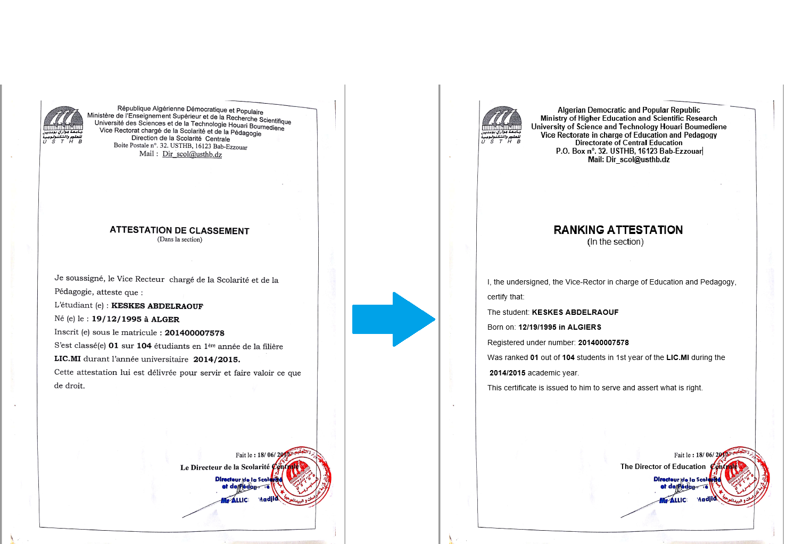

# TheWiseDocTranslator
the wise doc translator is a personal project where I aim to build a system that convert a document from a language to another keeping all the design (Layout, Logo, Sign,  ... )



## Config
**OS** : Ubuntu 18.04

**CPU** : Intel(R) Core(TM) i7-8750H CPU @ 2.20GHz

**GPU** : GeForce RTX 2070 with Max-Q Design

## Requirements

1) ``` pip install -r requirements.txt ```
2) PyTorch and its dependencies (torchvision, CUDA, ...) : https://pytorch.org/get-started/locally/
3) MMLab and its dependencies (NCCL, mmcv, ...) : https://mmediting.readthedocs.io/en/latest/install.html

Current working versions are : 
- Python = 3.8.5
- PyTorch = 1.7.1
- torchvision = 0.8.2
- CUDA = 11.0
- NCCL = 2 


## Usage

