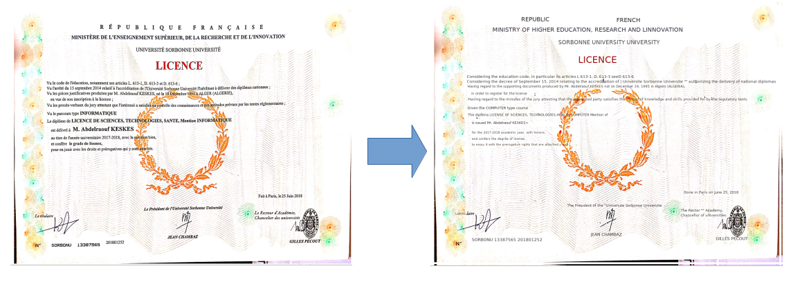

# TheWiseDocTranslator
the wise doc translator is a personal project where I aim to build a system that convert a document from a language to another keeping all the design (Layout, Logo, Sign,  ... )


## Demo
Video demo : [Linkedin Post](https://www.linkedin.com/posts/raouf-keskes_deeplearning-pytorch-computervision-activity-6751455772846120960-QbFJ)

## Config
**OS** : Ubuntu 18.04

**CPU** : Intel(R) Core(TM) i7-8750H CPU @ 2.20GHz

**GPU** : GeForce RTX 2070 with Max-Q Design

## Current Version 
The current stable software version is : 1.0

## Requirements

1) ``` pip install -r requirements.txt ```
2) PyTorch and its dependencies (torchvision, CUDA, ...) : https://pytorch.org/get-started/locally/
3) install MMEditing and its dependencies (NCCL, mmcv, ...) : https://mmediting.readthedocs.io/en/latest/install.html
Current working versions are : 
- Python = 3.8.5
- PyTorch = 1.7.1
- torchvision = 0.8.2
- CUDA = 11.0
- NCCL = 2 


## Usage
1) ```git clone https://github.com/raoufkeskes/TheWiseDocTranslator.git```
2) ```cd TheWiseDocTranslator```
4) Copy your custom MMediting installation folder into the project : ```cp -Rf SRC_PATH/mmediting/ ./```
5) Download pretrained : 
- [CRAFT](https://drive.google.com/file/d/1Jk4eGD7crsqCCg9C9VjCLkMN3ze8kutZ/view) 
- [STR](https://www.dropbox.com/sh/j3xmli4di1zuv3s/AAArdcPgz7UFxIHUuKNOeKv_a?dl=0) (according to your config, for example we actually use TPS-ResNet-BiLSTM-Attn.pth)
- [DeepFillv2 for Places2](https://github.com/open-mmlab/mmediting/tree/master/configs/inpainting/deepfillv2)
   
6) Fix all your parameters on config.yaml 
   such as : **data_folder**, **results_folder**, **dest_lang**, ... 
   
7) run ```python run_translation.py``` 


## First results 




## References
[1] Y. Baek, B. Lee, D. Han, S. Yun, and H. Lee, “Character region awareness for text detec-
tion,” in Proceedings of the IEEE Conference on Computer Vision and Pattern Recognition,
pp. 9365–9374, 2019.

[2] J. Baek, G. Kim, J. Lee, S. Park, D. Han, S. Yun, S. J. Oh, and H. Lee, “What is wrong with
scene text recognition model comparisons? dataset and model analysis,” in International
Conference on Computer Vision (ICCV), 2019.

[3] J. Yu, Z. Lin, J. Yang, X. Shen, X. Lu, and T. S. Huang, “Free-form image inpainting
with gated convolution,” in Proceedings of the IEEE International Conference on Computer
Vision, pp. 4471–4480, 2019.

[4] Z. Liu, P. Luo, X. Wang, and X. Tang, “Deep learning face attributes in the wild,” in
Proceedings of International Conference on Computer Vision (ICCV), December 2015.

[5] B. Zhou, A. Lapedriza, A. Khosla, A. Oliva, and A. Torralba, “Places: A 10 million im-
age database for scene recognition,” IEEE Transactions on Pattern Analysis and Machine
Intelligence, 2017.
